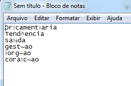

# Descrição do Problema

A compilação do arquivo pdf feita pela RSweave envolve as seguintes etapas:

1. Escrita do arquivo `.Rnw`, mesclando códigos em latex (`.tex`) com códigos em R inseridos em *chunks*;

2. A função Sweave() do R lê o arquivo gerado em 1, converte todo o conteúdo R nos chunks para tex e por fim gera um arquivo `.tex`;

3. O arquivo `.tex` gerado é compilado em pdflatex, xeLatex, ou qualquer outro compilador presente em *C:\Users\m1312932\Documents\MiKTeX 2.9\miktex\bin* ou descrito na variável de ambiente *RSTUDIO_PDFLATEX*.


O bug surge no terceiro momento. **Ao realizar a compilação do arquivo .tex em pdf qualquer carácter acentuado apresenta erros quando é copiado do pdf para o notepad/word. Ainda, esses caracteres não são apresentados como resultados na busca por palavras no pdf.**

**Exemplo do erro (Arquivo aberto no Adobe Reader copiado e colado no notepad):**




**A solução anteriormente adotada foi compilar o arquivo .tex gerado em 2 no texmaker, ou chamar pdflatex no CMD e compilar o arquivo .tex diretamente.**

[BUG REPORTADO NO STACKOVERFLOW](http://stackoverflow.com/questions/34729509/rsweave-how-to-copy-paste-from-pdf-to-notepad-avoiding-error)


# A causa do problema

Esse problema é gerado ao carregar a biblioteca Sweave em `\usepackage{Sweave}`. Em determinado trecho do código temos que:


```
#!Latex
                                         .
                                         .
                                         .

\ifthenelse{\boolean{Sweave@ae}}{%
  \RequirePackage[T1]{fontenc}
  \RequirePackage{ae}
}{}%

                                         .
                                         .
                                         .

```

Se a biblioteca `ae` não tiver sido carregada, está será carregada a partir do código a seguir. Essa biblioteca é considerada depreciada, segundo o [WikiBooks de fontes do latex](https://en.wikibooks.org/wiki/LaTeX/Fonts):

*The package ae (almost European) is obsolete. It provided some workarounds for hyphenation of words with special characters. These are not necessary any more with fonts like lmodern. Using the ae package leads to text encoding problems in PDF files generated via pdflatex (e.g. text extraction and searching), besides typographic issues.*

# Solução para o Problema

A solução adotada é alterar diretamente o código em Sweave.sty, realizando a seguinte alteração:

```
#!Latex
                                         .
                                         .
                                         .

\ifthenelse{\boolean{Sweave@ae}}{%    
  \RequirePackage[T1]{fontenc}    
%      \RequirePackage{ae}    
  \RequirePackage{helvet} 
  \renewcommand{\familydefault}{\sfdefault} 
}{}%    

                                         .
                                         .
                                         .

```
A estratégia utilizada foi comentar o código que carrega `ae` e no lugar carregar a biblioteca que aplica arial font **helvet** e defini-la como a fonte padrão do documento `\renewcommand{\familydefault}{\sfdefault}`. Essa atualização é executada automaticamente no script `LOA/utils/biblioteca Sweave/run_alterarBibliotecaSweave.R`. Alguns prós e contras dessa estratégia:


## Prós:
1. Voltamos a utilizar o botão compile do RStudio para gerar o documento em pdf, que dessa vez, será o documento final;
2. RStudio possui um sistema de debug melhor para eventuais erros no código;


## Contras:
1. `run_alterarBibliotecaSweave.R` reescreve `Sweave.sty` e pode inutilizar esse arquivo .sty caso ocorra um erro inesperado. Recomenda-se fazer um backup de Sweave.sty;
2. `run_alterarBibliotecaSweave.R` pode inutilizar futuras atualizações de Sweave.sty, que não sigam o padrão da atual Sweave.sty;
