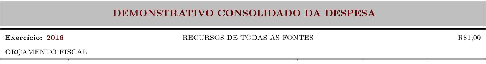
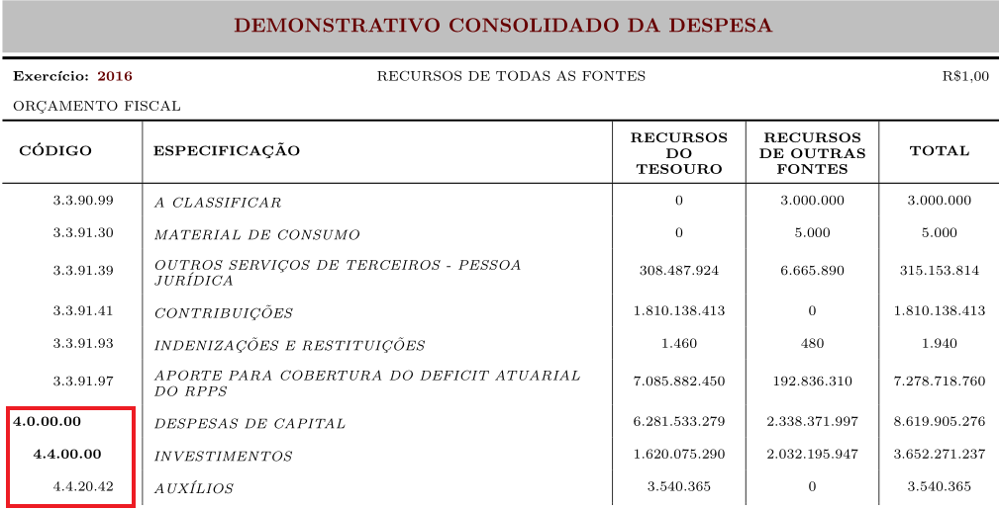

# Tabela Demonstrativo Consolidado da Despesa

Nese tutorial iniciamos a explicação da primeira tabela apresentada no volume 5: Demonstrativo consolidado da despesa. O objetivo desse tutorial é explicar os códigos utilizados e presentes no arquivo `LOA\volume5\Rnw\demonstrativo_consolidado_despesav1.Rnw`.

A primeira tag do arquivo é:

```
#!Latex

\documentclass{article}


```

A tag `\documentclass` inicia o documento como sendo da classe `article`. 

A seguir, carregamos uma série de pacotes necessário para a montagem do documento:


```
#!Latex
\input{load_bibliotecas}
```

Onde input carrega no presente arquivo `load_bibliotecas.tex`, **que deve estar presente em na mesma pasta em LOA\volume5\Rnw**. `load_bibliotecas.tex` carrega as seguintes bibliotecas:

```
#!Latex

\usepackage[usenames, dvipsnames]{color} % Adicionar novas cores via RGB
\usepackage{longtable} % Carrega o objeto longtable
\usepackage[table]{xcolor} % adiciona cor a uma linha ou coluna de uma tabela
\usepackage[utf8]{inputenc} % garante o encoding utf-8 no documento final
\usepackage{booktabs} % Customização de tabelas
\usepackage{geometry} % Possibilita mudar as margens das folhas no documento
\usepackage{array} % Possui uma série de atributos dentre eles a possibilidade de centralizar conteudo
\usepackage{multirow} % Garante mesclar linhas de uma coluna
\usepackage{tocloft} % Possibilita customizar o sumário
\usepackage{graphicx} % Importar imagens no documento
\usepackage{pdfpages} % Inserir páginas de outro pdf no documento
\graphicspath{ {img/} } % caminho das imagens 
\usepackage[hidelinks]{hyperref} % cria um hiperlink do sumário para cada tabela do documento
\usepackage{afterpage} % possibilita criar uma página em branco
\usepackage{scrextend} % ifelse para páginas pares e ímpares


% Alterar a fonte para Arial
\usepackage[T1]{fontenc}
\usepackage{uarial}
\renewcommand{\familydefault}{\sfdefault}


% NOVAS FONTES

\newcommand{\valorHeader}[1]{\scriptsize #1} % definição do comando \ValorHeader que atribui o tamanho de fonte \scriptsize a um elemento

\newcommand{\fonteSeis}[1]{\fontsize{6px}{2px}\selectfont #1} % definição do comando \fonteSeis que atribui o tamanho de fonte 6px a um elemento

% DEFINIÇÕES DE ESPAÇAMENTO VERTICAL (PADING)

\newcommand\Tstrut{\rule{0pt}{2em}}       % pading top para o titulo
\newcommand\Bstrut{\rule[-0.9ex]{0pt}{0pt}} % padding bottom para o titulo
\newcommand{\TBstrut}{\Tstrut\Bstrut}  % tag com a união do padding top e bottom

% DEFINIÇÃO DE NOVAS COLUNAS

% novo tipo de coluna que centraliza verticalmente e horizontalmente o conteúdo, quebra texto automaticamente e possibilita definir o tamanho (width) da célula

\newcolumntype{C}[1]{>{\let\newline\\\arraybackslash\hspace{0pt}}m{#1}} 

% novo tipo de coluna que centraliza verticalmente o conteúdo, quebra texto automaticamente, possibilita definir o tamanho (width) da célula e centralizar horizontalmente em relação a esquerda

\newcolumntype{L}[1]{>{\raggedright\let\newline\\\arraybackslash\hspace{0pt}}m{#1}} 


\newcommand{\tab}[1]{\hspace{13pt}\rlap{#1}} % definição do comando \tab que um espaçamento horizontal de 13pt antes de um elemento

% DEFINIÇÕES DE ESPAÇAMENTO

\setlength{\tabcolsep}{0.18cm} % Estabelece o espaçamento de 0.18 cm verticalmente entre células da tabela
\definecolor{myblack}{RGB}{0,0,0} % Define uma nova cor myblack com o RCG 0,0,0
\definecolor{vermelhoTitulo}{RGB}{102,0,0} % Define uma nova cor vermelhoTitulo com o RCG 102,0,0

\setlength{\cftbeforesubsecskip}{6pt} % Aumenta o espacamento antes do item subsecao na tabela de contents (sumario)
\setlength{\cftbeforesecskip}{15pt} % Aumenta o espacamento antes do item secao na tabela de contents (sumario)


% Para evitar a hiphenizacao das palavras (wrap:break-word)
% Embora os novos tipos de coluna **C** e **L** garantam a quebra de linha de forma a manter o conteúdo restrito a 
% dimensão da coluna, essa quebra é feita de maneira errada. A quebra de linha **parte** em qualquer lugar as 
% palavras que ficam próximas da borda, separando-as por um hífen. Assim, caso **especificação** esteja próxima da 
% borda, em uma linha o latex escreve *esp-* e na outra linha **ecificação**, o que é totalmente errado. Os comandos 
% abaixo, garantem que a hifenização não será realizada, impondo alta penalidade caso seja feita

\tolerance=1
\emergencystretch=\maxdimen
\hyphenpenalty=10000
\hbadness=10000

```

Ou seja, cada biblioteca auxilia em um aspecto do documento.

Iniciamos o documento pela tag `\begin{document}`

```
#!R

\begin{document}

# Bloco de Códigos

\end{document}
```

`\SweaveOpts{concordance=TRUE}` Gera o arquivo `demonstrativo_consolidado_despesav1-concordance.tex` ao compilar demonstrativo_consolidado_despesav1.Rnw. 
Os próximos comandos são:

```
#!Latex
\scriptsize % tamanho de fonte

\newgeometry{left=1cm,right=1cm, top=2cm} % Novas dimensões de página a serem aplicadas para todas as páginas que contém as tabelas.

\renewcommand*{\arraystretch}{1.9} % garante um espaçamento maior entre as linhas da tabela
 \color{myblack} % cor das fontes da tabela como sendo a cor definida como 'myblack'
 \centering % centralizar conteúdo
 
```

Todos os códigos referentes a construção da tabela estão dentro de um chunk:

```
#!R
<<>>=
# Códigos do R aqui
@
```
***IMPORTANTE: Não pode existir nenhum espaço antes de `<<>>=`, caso contrário o bloco não é compreendido como um bloco de comandos do R***. Quando estipulamos `<<echo = FALSE, results = tex>>=` os códigos do R não devem aparecer no documento e o resultado desses códigos devem ser considerados como um resultado do latex.

```
#!latex

<<echo=FALSE, results=tex>>=

  dir_loa = gsub("(.+LOA).*", "\\1", getwd())

  ANO_DOC = as.numeric(readLines(paste(dir_loa, "/utils/ano.txt", sep=""), warn = F))

  dir_data = paste(dir_loa,"/volume5/data", sep="")

  # INICIO TABELA

  consolidado = read.table(paste(dir_data, "/consolidado.txt", sep=""), header = T, sep = "\t", 
                           quote = NULL,   dec = ",", stringsAsFactors = FALSE)

.
.
.

```

Existe uma divergência entre qual é o diretório raiz para o Rsweave e Rproj. De forma direta o Rsweave entende que o diretório raiz é onde reside o arquivo `.Rnw` a ser compilado, enquanto para o Rproj, é o diretório onde está `LOA.Rproj`. `dir_loa` consegue determinar que o diretório raiz será `C:\Users\m1312932\SEPLAG\LOA` independentemente de como ele esta sendo executado.

`ANO_DOC` é uma variável que guarda o conteúdo de `C:\Users\m1312932\SEPLAG\LOA\utils\ano.txt`, no caso o ano de referência da LOA. O objeto `consolidado` carrega para o script o banco presente em `\LOA\volume5\data\consolidado.txt`, que é gerado via a execução do arquivo `LOA\volume5\R\volume5.R`. Ao estruturar esse banco de dados a preocupação foi gerar um banco **com a mesma estrutura do DEMONSTRATIVO CONSOLIDADO DA DESPESA** (por curiosidade abra esse arquivo no excel; este possui o mesmo formato do demonstrativo impresso no volume final). Assim, ao imprimir cada linha do banco, o quadro em questão é montado de maneira mais prática.

O comentário `# INICIO TABELA` é uma tag muito importante para construção do documento final. Esse comentário indica o início do código em `demonstrativo_consolidado_despesav1.Rnw` que será carregado em `LOA\volume5\Rnw\Projeto_volume5.Rnw`. O comentário `# FIM TABELA` indica aonde esse código termina. Mais sobre isso será dito no momento que falarmos sobre a forma projeto do volume 5.

```
#!Latex
\noindent\begin{longtable}[c]{m{0.1cm}m{0.1cm}m{0.8cm}|m{8cm}|m{2cm}|m{2cm}|m{2cm}}
```

`\noident` retira a identação dos conteúdos da tabela. `\begin{longtable}` inicia o objeto longtable. `[c]` centraliza a tabela na página. Como último parâmetro devemos indicar a quantidade de colunas que a tabela terá, como esse conteúdo será orientado e a largura das colunas. No presente caso serão 7 colunas, cada uma representada por `m{MEDIDA EM CM}`. m representa **middle**, ou seja, o conteúdo da coluna será centralizado verticalmente. **{2cm}** indica que a coluna terá uma largura de 2cm. As barras **|** indicam que nessa coluna deve ter uma borda lateral. Assim, `|m{8cm}|` é uma coluna com borda na **esquerda** e na **direita**, com 8cm de largura e com conteúdo centralizado verticalmente.

Iniciamos com o cabeçalho ta tabela, que contém o título da tabela e o nome das colunas. LongTable garante que, caso o conteúdo da tabela não caiba em apenas uma página, esse continua nas páginas seguintes com a possibilidade de mudança do cabeçalho. Assim, sempre definimos dois cabeçalhos e dois rodapés. O primeiro cabeçalho e rodapé vão na primeira página que a tabela aparece. O segundo cabeçalho e rodapé destinam-se as n páginas que a tabela se repete. Ou seja, definem-se cabeçalho e rodapé da página 1 e se a tabela se estende por mais 20 páginas, da página 2 à 20 será exibido o cabeçalho e rodapé 2. Por estilo das tabelas, o cabeçalho e rodapé sempre é o mesmo para as todas as páginas que a tabela ocupa, então faremos um cabeçalho e rodapé para as duas tabelas. Uma possibilidade que o R nos dá nesse caso é criar variáveis string chamadas titulo, subtitulo1, subtitulo2 e cabecalho que conterá todas as especificações em latex necessária para montar o cabeçalho. Um ponto positivo dessa implementação é que para mudar qualquer aspecto no cabeçalho basta mudar essas variáveis uma vez.


```
#!R

titulo="\\multicolumn{7}{c}{\\cellcolor{gray!50} \\textcolor{vermelhoTitulo} {\\normalsize \\textbf{DEMONSTRATIVO CONSOLIDADO DA DESPESA}}}\\TBstrut  \\\\[2ex]\n"
 
 subtitulo = paste("\\multicolumn{3}{l}{\\textbf{Exercício: \\textcolor{vermelhoTitulo}{", ANO_DOC, 
                   "}}} & \\multicolumn{3}{c}{RECURSOS DE TODAS AS FONTES}& \\multicolumn{1}{r}{R\\$1,00} \\\\\n")
 subtitulo1 = "\\multicolumn{7}{l}{ORÇAMENTO FISCAL} \\\\\n"
 
 cabecalho = paste("\\multicolumn{3}{l|}{\\textbf{ CÓDIGO}} & \\multicolumn{1}{l|}{\\textbf{ESPECIFICAÇÃO}} & ",
                   "\\valorHeader{\\centering \\textbf{RECURSOS DO TESOURO}} &",
                   "\\valorHeader{\\centering \\textbf{RECURSOS DE OUTRAS FONTES}} & ",
                   "\\multicolumn{1}{c}{\\textbf{TOTAL}}\\\\")
```
Essas variáveis são internas ao R (o comando `paste(...)` concatena texto). Para chamá-las no documento latex final, devemos imprimir essas variáveis a partir do comando `cat(...)`.


```
#!Latex
# Inicio: Primeiro cabeçalho
 cat(titulo)
 cat("\\specialrule{1.5pt}{2pt}{0pt}\n")
 cat(subtitulo)
 cat(subtitulo1)
 cat("\\specialrule{1pt}{0pt}{0pt}\n")
 cat(cabecalho)
 cat("\\hline\n")
 cat("\\endfirsthead\n") # Fim: Primeiro cabeçalho
 
# Inicio: Segundo cabeçalho
 cat(titulo)
 cat("\\specialrule{1.5pt}{2pt}{0pt}\n")
 cat(subtitulo)
 cat(subtitulo1)
 cat("\\specialrule{1pt}{0pt}{0pt}\n")
 cat(cabecalho)
 cat("\\hline\n")
 cat("\\endhead\n") # Fim: Segundo cabeçalho indica o término do cabeçalho padrão para o caso que a 
                    # tabela tenha mais de uma página.

# Início: Primeiro rodapé
 cat("\\endfoot\n") # Fim: Primeiro rodapé Qualquer conteúdo acima de \endfoot  seria replicado no rodapé de 
                    # todas as páginas da tabela, exceto a última. Como antes de \endfoot está \endhead 
                    # então não há nada nesse rodapé.

# Início: Segundo rodapé 
 cat("\\hline\n")

 cat("\\hline\\hline\n")
 cat("\\endlastfoot\n") # Fim: Segundo rodapé 
```

`\hline` cria uma borda horizontal na tabela (com espessura padrão do latex). `\endfirsthead` indica que acabou o primeiro header que acompanha o topo da tabela.
O primeiro rodapé não tem nada. No segundo definimos `\hline \hline  \hline` simplesmente para fechar a tabela com uma linha horizontal mais grossa.

Abaixo uma explicação dos comandos latex chamados no cabeçalho 


```
#!Latex

% Título
\multicolumn{7}{c}{\cellcolor{gray!50} \textcolor{vermelhoTitulo} {\normalsize \textbf{ DEMONSTRATIVO CONSOLIDADO DA DESPESA}}}\TBstrut  \\[2ex]
```
`\multicolumn{7}{c}{CONTEUDO}` Mescla as 7 colunas. `\cellcolor{gray!50}` aplica a cor *gray!50* na célula mesclada [Sobre as sintaxes das cores no latex](https://en.wikibooks.org/wiki/LaTeX/Colors). A parte `\textcolor{vermelhoTitulo} {\normalsize \textbf{ DEMONSTRATIVO CONSOLIDADO DA DESPESA}}}` muda a cor do texto para vermelho, aplica o tamanho \normalsize e aplica o negrito, respctivamente no nome **DEMONSTRATIVO CONSOLIDADO DA DESPESA**. `\TBstrut` aplica os padrões de padding-bottom e padding-top definidos acima ([O que é padding?](http://www.w3schools.com/css/css_padding.asp)). `[2ex]` aumenta a altura da célula mesclada para 2ex.

```
#!Latex
\specialrule{1.5pt}{2pt}{0pt}

% Subtitulo1
 \multicolumn{3}{l}{\textbf{Exercício: \textcolor{vermelhoTitulo}{2016}}} & \multicolumn{3}{c}{RECURSOS DE TODAS AS FONTES}& \multicolumn{1}{r}{R\$1,00} \\

% Subtitulo2
 \multicolumn{7}{l}{ORÇAMENTO FISCAL} \\
 \specialrule{1pt}{0pt}{0pt}
```

`\specialrule{1.5pt}{2pt}{0pt}` gera uma linha mais espessa como bottom/top borda. 1.5pt é a espessura da linha, 2pt é o padding-top e 0pt é o padding-bottom. O cabeçalho final fica:





O próximo conjunto de comandos determina os nomes das colunas.

```
#!Latex

\multicolumn{3}{l|}{\textbf{ CÓDIGO}} & 
\multicolumn{1}{l|}{\textbf{ESPECIFICAÇÃO}} & 
\valorHeader{\centering \textbf{RECURSOS DO TESOURO}} & 
\valorHeader{\centering \textbf{RECURSOS DE OUTRAS FONTES}} & 
\multicolumn{1}{c}{\textbf{TOTAL}} \\

```

A primeira coluna mescla as três primeiras colunas e da o nome de Código com alinhamento a esquerda e borda a direita **{l|}**. O simbolo **&** indica que a próxima informação estará na próxima coluna. Como já mesclamos três colunas só há disponível mais 4 colunas. `\multicolumn{1}{l|}{\textbf{ESPECIFICAÇÃO}}` garante que ESPECIFICAÇÃO fique alinhado a esquerda e só mescle uma coluna. `\valorHeader{\centering \textbf{RECURSOS DO TESOURO}}` ao nome RECURSOS DO TESOURO são aplicados os comandos `\valorHeader` definido no começo do documento, `\centering` para centralizar o conteúdo horizontalmente, e aplicar negrito `\textbf`. O parâmetro **{c}** em `multicolumn{1}{c}{\textbf{TOTAL}}` indica que esse conteúdo deve ser centralizado. *Aparentemente aplicar `\centering` nessa última coluna resulta em erro!!!*


Em seguida imprimimos no documento cada linha do banco consolidado, carregado no `R`. Para cada linha i variando de 1 ao total de linhas no banco consolidado (1:nrow(consolidado)), imprimimos cada linha conforme segue:


```
#!Latex

for(i in 1:nrow(consolidado)){

  # IMPRIMIR CADA LINHA i aqui
}
```

Cada linha no banco deve ser imprimida na tabela de forma diferente. Inicialmente temos duas condições:

### 1. O codigo_texto na linha i é diferente de total e a linha i não é a última linha:


```
#!R

if(consolidado$codigo_texto[i]!="Total" & i < nrow(consolidado)){

# REGRAS PARA AS LINHAS QUE SATISFAÇAM A CONDIÇÃO GERAL 1

}
```

### 2.O codigo_texto na linha i é igual ao texto total e a linha i é a última linha:

```
#!R

if (consolidado$codigo_texto[i] == "Total" & i == nrow(consolidado)){

# REGRAS PARA AS LINHAS QUE SATISFAÇAM A CONDIÇÃO GERAL 2

}
```


Se a linha satisfaz a CONDIÇÃO GERAL 1, esta pode satisfazer três condições distintas:

### 1.1- Regra de impressão para CATEGORIA DE DESPESA: Se grupo despesa for 0 ou 9. Aplica-se as linhas referentes a **3.0.00.00 DESPESAS CORRENTES, 4.0.00.00 DESPESAS DE CAPITAL e 9.9.99.99 RESERVA DE CONTINGÊNCIA**

```
#!R
if(substr(as.character(consolidado$codigo_texto[i]),3,3)=="0" | 
substr( as.character(consolidado$codigo_texto[i]), 3 , 3)=="9"){

  cat("\\multicolumn{3}{l|}{\\textbf{", as.character(consolidado$codigo_texto[i]), 
     "}} & \\multicolumn{1}{L{8cm}|}{\\textit{", as.character(consolidado$especificacao[i]), 
     "}} & \\multicolumn{1}{r|}{",   as.character(consolidado$recurso_tesouro[i]) , 
      "} & \\multicolumn{1}{r|}{", as.character(consolidado$outras_fontes[i]), 
      "} &  \\multicolumn{1}{r}{", as.character(consolidado$total[i]), "}\\\\\n", sep="")
}
```

`cat` é um comando do R que concatena texto com um delimitador definido pelo parâmetro `sep` e logo em seguida imprime o resultado. O conteúdo imprimido por `cat` estará no `.tex`. O caracter \ é um caracter especial, que para ser imprimido corretamente deve se repetido duas vezes (o primeiro \ indica que se trata de um caracter especial, que no caso é \). 

No caso descrito nesse condicional mesclamos as três primeiras colunas e negritamos (`\\textbf{}`) o código texto em `consolidado$codigo_texto[i]`. A segunda coluna tem alinhamento para esquerda com quebra de texto e 8cm de largura, (`\\multicolumn{1}{L{8cm}|}{...}`) com texto em itálico (`\\textit{...}`) para especificação (`consolidado$especificacao[i]`). As variáveis `consolidado$recurso_tesouro[i]`, `consolidado$outras_fontes[i]` e `consolidado$total[i]` tem alinhamento para a direita `\\multicolumn{1}{r|}{...}` e barra vertical na direita, salvo `consolidado$total[i]`.


### 1.2- Regra para impressão de GRUPOS DE DESPESA. Aplica-se as linhas referentes a **3.1.00.00 PESSOAL E ENCARGOS SOCIAIS, 3.2.00.00 JUROS E ENCARGOS DA DÍVIDA** dentre outros.

```
#!R
 else if(substr(as.character(consolidado$codigo_texto[i]),5,6)=="00"){

  cat("\\multicolumn{1}{l}{} & \\multicolumn{2}{l|}{\\textbf{", as.character(consolidado$codigo_texto[i]), 
        "}} & \\multicolumn{1}{L{8cm}|}{\\textit{", as.character(consolidado$especificacao[i]), 
        "}} & \\multicolumn{1}{r|}{", as.character(consolidado$recurso_tesouro[i]) , 
         "} & \\multicolumn{1}{r|}{", as.character(consolidado$outras_fontes[i]), 
         "} &  \\multicolumn{1}{r}{", as.character(consolidado$total[i]), "}\\\\\n", sep="")

    }
```

Ao iniciar a linha com `\\multicolumn{1}{l}{}`, conseguimos "criar um espaço em branco" nos códigos para que os totais globais (grupo despesa for 0 ou 9) fiquem mais a esquerda, os subtotais (modalidade 00) fique um pouco mais a direita.

### 1.3- Regra para impressão por MODALIDADE E ELEMENTO. As linhas que se adequam a regra geral 1, **mas não se adequam a regra 1.1 e 1.2** (demais linhas). É o caso de 3.1.90.01 APOSENTADORIAS DO RPPS, RESERVA REMUNERADA E REFORMAS DOS MILITARES, 3.1.90.03 PENSÕES DO RPPS E DO MILITAR dentre outros:


```
#!R

else{
      cat("\\multicolumn{1}{l}{} & \\multicolumn{1}{l}{} & \\multicolumn{1}{l|}{",                                 
                                                                   as.character(consolidado$codigo_texto[i]), 
          "} & \\multicolumn{1}{L{8cm}|}{\\textit{",as.character(consolidado$especificacao[i]), 
         "}} & \\multicolumn{1}{r|}{",  as.character(consolidado$recurso_tesouro[i]) , 
          "} & \\multicolumn{1}{r|}{", as.character(consolidado$outras_fontes[i]),
          "} &  \\multicolumn{1}{r}{", as.character(consolidado$total[i]), "}\\\\\n", sep="")
    }
```

Ao iniciar a linha com dois `\\multicolumn{1}{l}{}`, conseguimos colocar esses códigos mais a direita comparado aos de modalidade "00". Ainda, nada nessas linhas é negritado.

Dessa forma conseguimos "identar" os códigos para que os totais globais (grupo despesa for 0 ou 9) fiquem mais a esquerda, os subtotais (modalidade 00) fique um pouco mais a direita e os demais fiquem mais a direita. Exemplo:




Na CONDIÇÃO GERAL 2, a saber, o codigo_texto na linha i é igual ao texto total e a linha i é a última linha apresenta uma condição especial para a última linha do banco que apresenta o total. Para esta linha, o código aplicado deve ser:


```
#!R

if (consolidado$codigo_texto[i]=="Total" & i==nrow(consolidado)){

  cat("\\hline\n",
      "\\multicolumn{4}{c|}{\\textbf{", toupper(as.character(consolidado$codigo_texto[i])), 
      "}} & \\multicolumn{1}{r|}{", as.character(consolidado$recurso_tesouro[i]) , 
       "} & \\multicolumn{1}{r|}{", as.character(consolidado$outras_fontes[i]), 
       "} &  \\multicolumn{1}{r}{", as.character(consolidado$total[i]), "}\n", sep="")
    
  }
```

Assim, aplicamos uma linha horizontal antes do total (`\\hline\n`) e mesclamos as colunas referentes a codigo e especificacao para simplesmente apresentar a palavra total (`\\multicolumn{4}{c|}{\\textbf{", toupper(as.character(consolidado$codigo_texto[i]))}}`).

Em uma perspectiva geral, temos que:


```
#!R

for(i in 1:nrow(consolidado)){ # para cada linha i entre 1 e o total do banco consolidado
  # 1. INICIO: Os condicionais a seguir tem como objetivo identar os codigos de despesa de acordo com os itens isolados e totais

  if(consolidado$codigo_texto[i]!="Total" & i<nrow(consolidado)){


    # 1.1 INICIO
    if(substr(as.character(consolidado$codigo_texto[i]),3,3)=="0" | 
        substr(as.character(consolidado$codigo_texto[i]),3,3)=="9"){
  
      cat("\\multicolumn{3}{l|}{\\textbf{", as.character(consolidado$codigo_texto[i]),
          "}} & \\multicolumn{1}{L{8cm}|}{\\textit{", as.character(consolidado$especificacao[i]), 
          "}} & \\multicolumn{1}{r|}{", as.character(consolidado$recurso_tesouro[i]) , 
          "} & \\multicolumn{1}{r|}{", as.character(consolidado$outras_fontes[i]), 
          "} &  \\multicolumn{1}{r}{", as.character(consolidado$total[i]), "}\\\\\n", sep="")

    # 1.1 FIM

    # 1.2 INICIO
    } else if(substr(as.character(consolidado$codigo_texto[i]),5,6)=="00"){

      cat("\\multicolumn{1}{l}{} & \\multicolumn{2}{l|}{\\textbf{", as.character(consolidado$codigo_texto[i]), 
          "}} & \\multicolumn{1}{L{8cm}|}{\\textit{", as.character(consolidado$especificacao[i]), 
          "}} & \\multicolumn{1}{r|}{", as.character(consolidado$recurso_tesouro[i]) , 
          "} & \\multicolumn{1}{r|}{", as.character(consolidado$outras_fontes[i]), 
          "} &  \\multicolumn{1}{r}{", as.character(consolidado$total[i]), "}\\\\\n", sep="")
    # 1.2 FIM

    # 1.3 INICIO
    } else{

      cat("\\multicolumn{1}{l}{} ", 
          "& \\multicolumn{1}{l}{} ",
          "& \\multicolumn{1}{l|}{", as.character(consolidado$codigo_texto[i]), 
          "} & \\multicolumn{1}{L{8cm}|}{\\textit{", as.character(consolidado$especificacao[i]), 
          "}} & \\multicolumn{1}{r|}{", as.character(consolidado$recurso_tesouro[i]) , 
           "} & \\multicolumn{1}{r|}{", as.character(consolidado$outras_fontes[i]),
          "} &  \\multicolumn{1}{r}{", as.character(consolidado$total[i]), "} \\\\\n", sep="")
    }
    # 1.3 FIM
  }
  # 1 FIM

  # 2. INICIO: 
  if (consolidado$codigo_texto[i]=="Total" & i==nrow(consolidado)){
  
    cat("\\hline\n\\multicolumn{4}{c|}{\\textbf{", toupper(as.character(consolidado$codigo_texto[i])), 
        "}} & \\multicolumn{1}{r|}{", as.character(consolidado$recurso_tesouro[i]) , 
        "} & \\multicolumn{1}{r|}{", as.character(consolidado$outras_fontes[i]), 
        "} &  \\multicolumn{1}{r}{", as.character(consolidado$total[i]), "}\n", sep="")
    
  }
  # 2. FIM
}
# FIM do 'for'
```

Em seguida fechamos a longtable, o chunk no R e a área de código que será transferida para o documento final do volume 2 (`# FIM TABELA`).

```
#!R

cat("\\end{longtable}\n")

# FIM TABELA

@
```

E por fim fechamos o documento

```
#!latex

\end{document}
```

