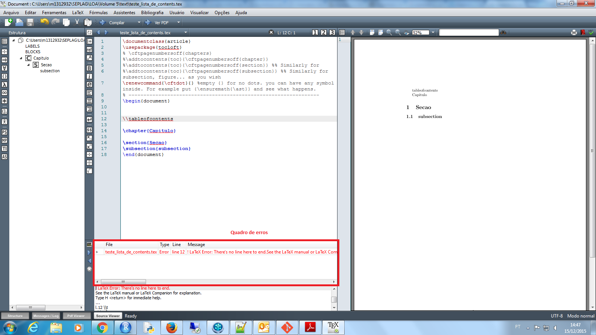

A integração do R com o latex (Sweave R), apresenta um painel de apresentação dos erros pouco informativo. Assim, caso surja dúvidas na sintaxe de um código ***exclusivamente escrito em latex***, a melhor opção seja escrevê-lo e compila-lo no Texmaker, um programa desenvolvido para desenvolvimento em latex. Neste programa, os erros são melhores apresentados, bem como o log de execução do pdflatex.exe (um executável que compila os códigos em latex para o formato PDF)

[Download Texmaker](http://www.xm1math.net/texmaker/)

Para o desenvolvimento das tabelas dos relatórios da LOA, o padrão de trabalho executado foi, inicialmente, montar as tabelas no Texmaker. Uma vez que o código em latex esteja ok, repassar esse código para o RStudio adicionando objetos do R.
